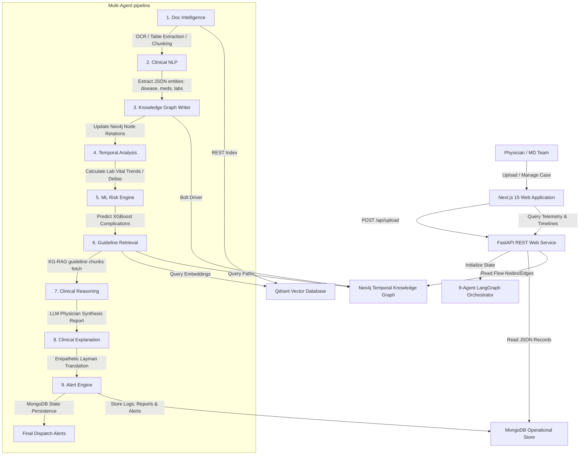

# MedSphere AI — Healthcare Clinical Intelligence & Decision Support Platform

MedSphere AI is an enterprise-grade clinical intelligence and decision-support platform designed to ingest unstructured electronic health records (discharge summaries, patient notes, prescriptions, and lab tests) and compile them into explainable, structured clinical pathways.

The system features a **9-node clinical multi-agent workflow** structured inside LangGraph, a trained **XGBoost risk classifier** calculating patient complication scores, a **Temporal Trend Analyzer** tracking laboratory vital changes (like HbA1c curves), and a unified **Digital Twin Patient Registry** featuring inline parsed decision traces.

---

## 🏗️ System Architecture & Workflow

MedSphere AI is built as a sequential workflow where medical data flows through domain-specific intelligence agents, terminating with the dispatcher alert system.



---

## 📂 Project Directory Structure

```
d:/PROJECT/MedSphere/
├── backend/
│   ├── app/
│   │   ├── __init__.py
│   │   ├── main.py              # FastAPI Web service entrypoint
│   │   ├── config.py            # Pydantic settings config load
│   │   ├── auth.py              # JWT authentication & RBAC system
│   │   ├── database/
│   │   │   ├── mongo.py         # MongoDB connections & Fallback storage
│   │   │   ├── neo4j_db.py      # Neo4j Session manager & mock Cypher queries
│   │   │   ├── qdrant_db.py     # Qdrant Client & Vector index manager
│   │   │   └── importer.py      # Seeding script for mock datasets
│   │   ├── nlp/
│   │   │   └── clinical_nlp.py  # Entity extraction & regex backup parse
│   │   ├── ml/
│   │   │   └── risk_trainer.py  # XGBoost training pipeline
│   │   ├── agents/
│   │   │   ├── state.py         # LangGraph ClinicalState schema
│   │   │   └── workflow.py      # 9-Agent LangGraph flow nodes (Alert last)
│   │   └── routes/
│   │       ├── auth.py          # User authentication endpoints
│   │       ├── patients.py      # Digital Twin case workspace timelines
│   │       ├── agents.py        # Trigger pipeline & status log trace endpoints
│   │       ├── graph.py         # Neo4j to React Flow translation
│   │       ├── guidelines.py    # Guidelines semantic search
│   │       └── upload.py        # Unstructured PDF/DOCX ingestion OCR
│   ├── tests/
│   │   └── test_clinical_suite.py # Integration test suite for agents & api
│   ├── requirements.txt
│   └── Dockerfile
├── frontend/
│   ├── src/
│   │   ├── app/
│   │   │   ├── layout.tsx       # Hospitality greeting portal & shell
│   │   │   ├── page.tsx         # Redirect controller
│   │   │   ├── dashboard/       # Command center & population telemetry
│   │   │   ├── patients/        # Twin Workspace & Patient comparison matrices
│   │   │   ├── globals.css      # Core Vanilla CSS overrides
│   │   │   └── next.config.ts   # Next.js workspace configurations
│   ├── store/
│   │   └── useStore.ts          # Zustand state store & Axios endpoint mappings
│   ├── public/
│   │   └── wellness_lobby.png   # Premium wellness sanctuary ambient background
│   ├── package.json
│   └── Dockerfile
├── docker-compose.yml           # Multi-container orchestration configurations
└── README.md
```

---

## ⚡ Deployment & Startup Guide

### Database Storage Options
MedSphere AI features a **Dual-Mode Database Architecture**. If Docker instances of MongoDB, Neo4j, or Qdrant are offline, the application automatically triggers local memory-based caches. This allows developers to run the entire backend with zero database dependency setup!

---

### Option 1: Run with Docker Compose (Recommended)

1. **Verify Environment Variables**:
   Open `.env` in `backend/` and make sure your OpenRouter credentials are set:
   ```env
   OPENAI_API_KEY=sk-or-v1-d7b06...
   OPENAI_BASE_URL=https://openrouter.ai/api/v1
   ```

2. **Build and Launch Containers**:
   From the workspace root directory, run:
   ```bash
   docker-compose up --build
   ```

3. **Auto-Seeding & Model Training**:
   During initialization, the backend automatically validates databases. If MongoDB is empty, it launches `importer.py` (seeding cases and patient mock registers), indexes clinical rules in Qdrant, and runs `risk_trainer.py` to output the XGBoost model binary (`risk_model.pkl`).

4. **Service Endpoints**:
   - **Frontend UI**: [http://localhost:3000](http://localhost:3000)
   - **FastAPI API Documentation**: [http://localhost:8000/docs](http://localhost:8000/docs)
   - **Neo4j Console**: [http://localhost:7474](http://localhost:7474)

---

### Option 2: Running Locally for Development

#### 1. Launch the Backend REST Service
1. Navigate to the `backend/` directory:
   ```bash
   cd backend
   ```
2. Create and activate a Python virtual environment:
   ```powershell
   python -m venv venv
   .\venv\Scripts\activate
   ```
3. Install dependencies:
   ```bash
   pip install -r requirements.txt
   ```
4. Run dataset importing & model compiler script:
   ```bash
   python app/database/importer.py
   python app/ml/risk_trainer.py
   ```
5. Start the REST web server:
   ```bash
   uvicorn app.main:app --reload --port 8000
   ```

#### 2. Launch the Frontend Dev Server
1. Navigate to the `frontend/` directory:
   ```bash
   cd ../frontend
   ```
2. Install node dependencies:
   ```bash
   npm install
   ```
3. Start Next.js Development Server:
   ```bash
   npm run dev
   ```
4. Navigate to [http://localhost:3000](http://localhost:3000).

---

## 🔒 Access Credentials & Authorization

MedSphere AI uses a premium, split-screen **Luxury Hospitality Greeting Portal** for unauthenticated access. You can login using the autofill buttons or manually verify signatures:

* **Doctor Mode (Case Manager / Timelines)**:
  - Username: `doctor`
  - Password: `password123`
* **Admin Mode (Population Analytics & Telemetry)**:
  - Username: `admin`
  - Password: `admin123`

---

## 🔬 Testing & Pipeline Validation

Run the backend integration and testing suites (which validate JWT security tokens, fallback NLP regex entity parsers, and the 9-node state graph workflow execution):

```bash
cd backend
pytest tests/test_clinical_suite.py
```
All assertions should return green passes.
